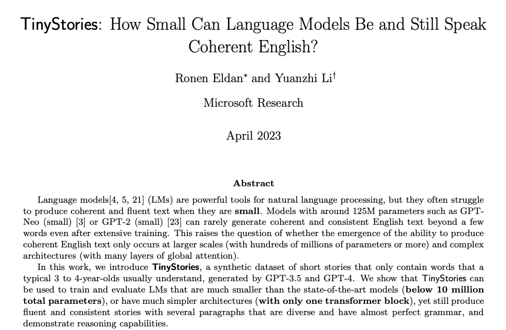

# Reproducing TinyStories small language model (SLM)

This repository contains a reproduction of the **TinyStories** language models described in the paper [**"TinyStories: How Small Can Language Models Be and Still Speak Coherent English?"**](https://arxiv.org/abs/2305.07759) by Ronen Eldan and Yuanzhi Li.

The goal of this project is to demonstrate that a very small transformer model, when trained on a simplified, synthetic dataset, can generate fluent, grammatically correct, and consistent short stories.

## 📄 Abstract

> "We introduce TinyStories, a synthetic dataset of short stories that only contain words that a typical 3 to 4-year-olds usually understand, generated by GPT-3.5 and GPT-4. We show that TinyStories can be used to train and evaluate LMs that are much smaller than the state-of-the-art models (below 10 million total parameters)... yet still produce fluent and consistent stories." — *Eldan & Li (2023)*

## 🧩 Model Architecture

This model is a decoder-only Transformer (GPT-style) designed to fit within 10M trainable parameters.

### Configuration 1: Model Size `XS` (3.6M)

| Hyperparameter | Value |
| :--- | :--- |
| **Parameters** | **~3.6 Million** |
| **Attention Layers** | 8 |
| **Hidden Dimension (Embedding Dimensions)** | 64 |
| **Attention Heads per Layer** | 16 |
| **Context Window** | 512 tokens |
| **Vocab Size** | ~50,257 (GPT-Neo tokenizer) |
| **Dropout** | 0.1 |
| **Learning Rate** | 5e-4 |

## 📚 Dataset

The model was trained on the **TinyStories** dataset, which consists of synthetic short stories generated by GPT-3.5/4. The stories use a restricted vocabulary typical of a 3-year-old child.

- **Source**: [Hugging Face Datasets (roneneldan/TinyStories)](https://huggingface.co/datasets/roneneldan/TinyStories)
- **Size**: ~2GB text data
